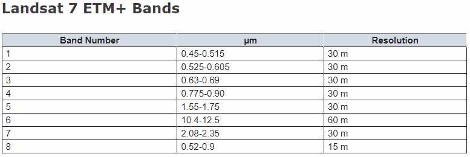
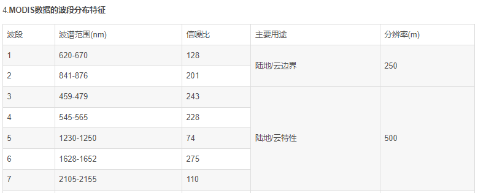
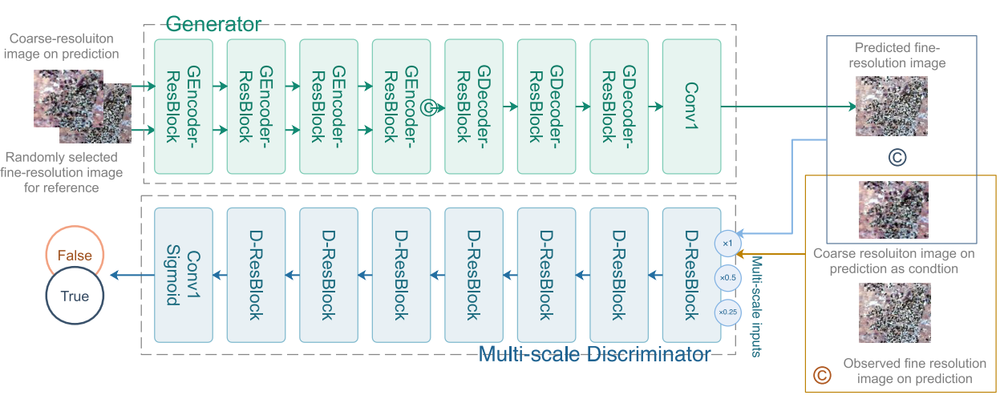
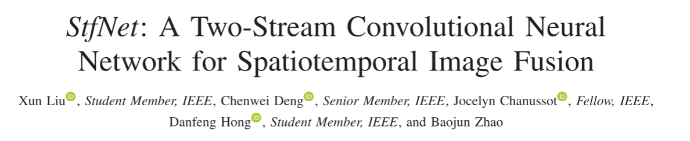
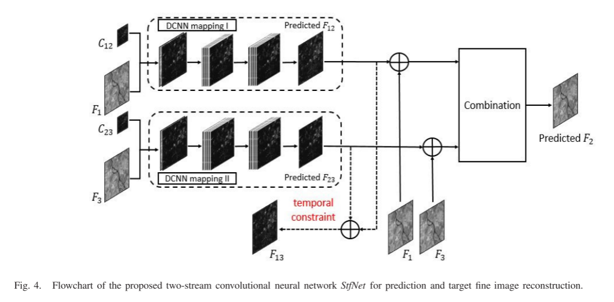
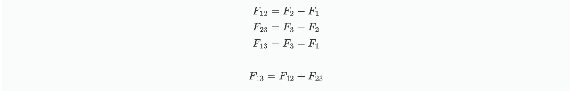
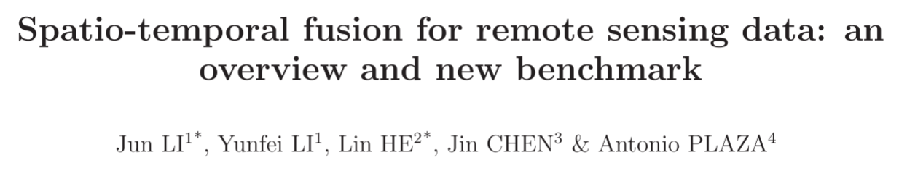
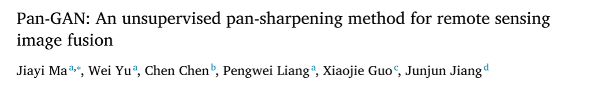
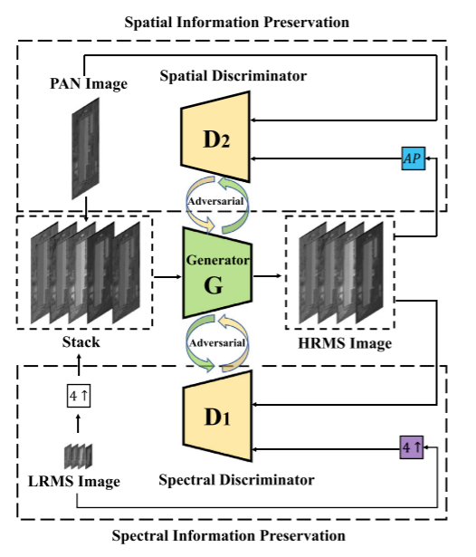
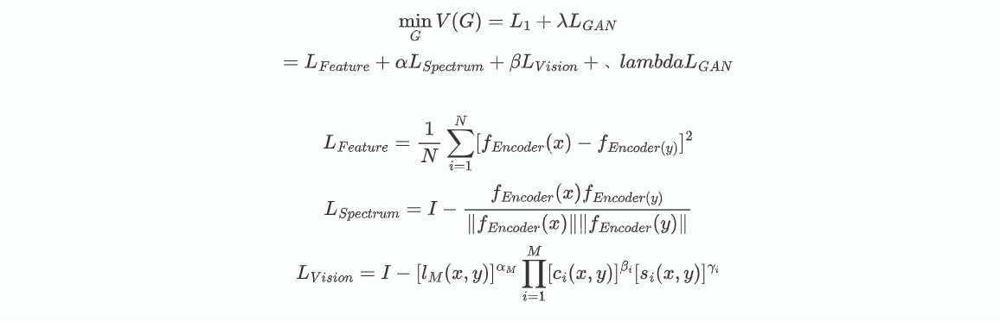

**工作内容概要：**

1. 关于综述论文的阅读和对该方向的基本了解。
2. 学习baseline论文和代码

这两周阅读了两篇综述，主要学习到以下几个方面

**工作内容（ 2023 年 10 月 14日- 2023 年 10 月 28日）:**

1. 综述论文的阅读主要了解到了以下4个方向。

**时空融合方向基本问题**

由于技术和预算的限制，在遥感仪器存在一些权衡，使得难以同时获取高时空分辨率的遥感图像。所以使用时空融合模型来通过高时间低空间分辨率和高空间低时间分辨率的图像来生成高时间高空间分辨率的图像。

**主要数据集**

大致可以分为MODIS高时间分辨率数据和LANDSAT高空间分辨率数据，由这两种数据组成CIA和LGD数据集。

在数据集中的MODEST和LANDSAT数据只用了6个光谱（6个通道）

分别是：蓝、绿、红、近红外、中红外1、中红外2。

**主要评测指标**

- 均方根误差（Root Mean Square Error，RMSE）来评估重建结果的辐射误差
- 结构相似性准则（Structural SIMilarity，SSIM）来评估结构间的相似性
- 采用了一些光谱指标来测量光谱损失
  - 光谱角（Spectral Angle Mapper，SAM）
  - 相对平均光谱误差（Relative Average Spectral Error ， RASE ）
  - 相对全局合成误差（ Erreur Relative Globale Adimensionnelle de Synthese，ERGAS）
  - 四元数 Q4(Quaternion theory-based quality index)

RMSE、SAM、RASE 和 ERGAS 的值越小越好，而 SSIM 和 Q4 的值越大越好

**算法分类**

- 基于加权的方法
- 基于解混的方法
- 基于字典对学习的方法
- 基于神经网络的方法和组合性方法。

2. baseline论文和代码的阅读

论文的主要解决的问题是：利用不同时间同一地点的粗细粒度图像来生成高时间分辨率的精细图像（第一个解决该问题的论文）

解决该问题使用的方法是：

- 使用CGAN驱动网络沿预期方向搜索最优解的思想和LSGAN损失提高GAN的稳定性。
- 使用SwitchNorm来强制模型过滤掉特定于样本中的信息，只提取常见的高通细节

论文的整体框架是：

生成器和鉴别器都是基于ResNet构建块构建，缓解深层网络中梯度消失和梯度爆炸

生成器会通过与训练好的Autoencoder来进行特征损失的计算，减少了抽象高级特征的差异。在生成器生成图片后使用多尺度滤波器来增强输出图像

鉴别器中使用了Spectral normalization来保证隐函数的Lipschitz连续性。

关于代码，整体流程已经熟悉，从输入，训练到输出有一个整体印象。对输入和数据处理已经全部理解，但是训练过程还有很多细节没有弄懂，接下来的任务应该继续理解训练过程和寻找GAN相关的模型，了解GAN的原理和具体如何解决问题。

**下周工作计划：**

1. 对图像融合领域和传统时空融合方法做一个了解，拓展视野。
2. 学习baseline中没有理解的部分，像SwitchNorm、GAN的原理等。
3. 继续读相关论文，总结论文解决的问题和创新点。

## 11-10——11-24

阅读论文

仔细研究baseline

关于baseline论文的学习，在生成器阶段，作者使用了autoencoder来对生成器生成的图片进行规范。在这里我想了到知识蒸馏，所以去了解了一些知识蒸馏的概念，发现确实很像。知识蒸馏的一个很大的作用就是简化模型，指导学生模型学习到教师模型学到的特征。所以结合老师周4发的SAMFeat，用SAMFeat思想指导学习局部特征（感觉想法和空，接下来应该继续了解和证明是否可行）

**工作内容概要：**

1. 读了4篇论文
1. 了解了一下知识蒸馏方法

**工作内容（ 2023 年 11 月 10日- 2023 年 11 月 24日）:**

1. **论文阅读**

:one:

主要解决的问题：

很多算法都是讲时空融合处理为单幅图像的超分辨率文。在实际应用中，粗糙图像需要被放大的倍数较大，通常在8到16倍之间。这意味着需要将低分辨率的图像放大到较高的分辨率，使得粗图像的空间信息损失较大。

使用方法：

利用精细图像序列中的时间信息，使用一种称为StfNet的双流卷积神经网络来解决时空融合问题。

创新点：

1. 结合相邻日期获取的精细图像对预测日期的粗略图像进行超分辨
2. 时间序列图像之间的时间关系，并制定了时间约束

模型架构：

双流架构作用体现在用$C_{12}和F_1来预测F_{12}$，$C_{23}和F_3来预测F_{23}$，在通过$F_{13}$的约束和$F_1$和$F_3$生成两张$F'_2$，再通过组合生成最终的$F2$。

个人总结：

时间相关性：从前后的精细图像中找到一个映射关系来预测中间的精细图像。

时间一致性：

$$
F_{12}=F_2-F_1\\
F_{23}=F_3-F_2\\
F_{13}=F_3-F_1\\
\\
F_{13}=F_{12}+F_{23}
$$
预测结果需要满足最后一个式子，所以就出现了时间一致性的约束。

:two:

个人总结：

文章的创新主要在于提出了3个新的数据集，且3个数据集包含3个重要的特征。

还提供了一个STF技术的综述，对各个类型的STF算法进行试验，并进行比较。

整体看下来，值得去记忆和学习的只有：

1. 三个数据集和它们的特征。

   (1)**区域多样性。**STF技术有多个应用领域，如城市、农村、森林和山区。因此，STF技术的任何基准数据集都应包括尽可能多的不同土地覆盖情景。换句话说，数据集越多样化，对STF方法的评估就越全面。

   (2)**时间跨度长。**一个特定地区的地表变化可以是非常多样化的。因此，基准数据集应该尽可能多地涵盖这些可能的变化。因此，非常需要覆盖长时间跨度的图像序列。为了测试STF方法的稳健性，这样的序列非常重要。另一方面，从方法论的角度来看，基于深度学习的方法的开发需要相对大量的训练数据集，因此长时间跨度的数据适合于这一背景。

   (3)**具有挑战性的场景。**STF方法的验证还有其他几个挑战，包括精细图像和粗略图像之间的空间分辨率差距、异质区域变化的表征以及土地覆盖变化的预测。这些方面也应包括在STF方法的任何相关基准数据集中。

2. STF方法的分类和代表方法STARFM、ESTARFM、FSDAF、STFDCNN和BiaSTF

:three:

这篇论文是在帮学长写报告的时候发现的，但是有很多东西都没看懂，所以只通过博客做了一个大概的了解。

总结

探索动机：在2020年，视觉Transformers，尤其是Swin Transformers等分层Transformers开始取代ConvNets，成为通用视觉主干的首选。人们普遍认为，视觉Transformers比ConvNets更准确、更高效、更易扩展。但是大量的工作其实是将之前运用在CNN网络结构上的思路改进到Transformers结构当中去。而且现在有更多的数据，更好的数据增强，以及更加合理的优化器等但所以vision Transformers之所以能够取得SOTA的效果，会不会是这些其他因素影响了网络。Transformers到底是厉害在哪了？

工作目标：如果把这些用在transformer上的技巧用在CNN上之后，进而重新设计ConvNet，卷积能达到的效果的极限是在哪里？是否也能得到相似的结果呢？

 核心思想**：**ConvNeXt在ResNet50模型的基础上，仿照Swin Transformers的结构进行改进而得到的纯卷积模型。模型改进可以分为：整体结构改变、层结构改变和细节改变三大部分。

实现方法：

实现方法部分

> Training Techniques
>
> Macro Design
>
> ResNeXt-ify
>
> Inverted Bottleneck
>
> Large Kernel Sizes
>
> Micro Design

在周三，老师也发了关于CNN和VIT的比较的微信推文。

推文主要介绍的是CNN和VIT的在在架构、内部表示、鲁棒性和性能方面的比较。而这篇论文是通过对CNN的优化以达到更好的效果。这两篇文章都能在实验中对CNN和VIT的选择或优化进行指导。

:four:

解决的问题：

（1）现有的基于CNN的策略需要监督，其中低分辨率多光谱图像是通过简单地对高分辨率图像进行模糊和向下采样来获得的。

（2）通常会忽略全色图像的丰富空间信息。

解决方法：

提出了一种基于产生式对抗网络的无监督泛锐化框架PanGAN可以共同保留LRMS图像的丰富光谱信息和全色图像的丰富空间信息。

创新点：

1）与其他基于CNN的泛锐化方法不同，无监督泛锐化框架 (Pan-GAN) 基于生成对抗网络，该网络不依赖于所谓的groundtruth，并且训练过程基于原始源图像通过设计特定的损失函数。

2）提出的Pan-GAN采用两个鉴别器来强制生成的图像的光谱和空间信息分别与LRMS和全色图像一致。这样，可以同时保留LRMS图像的丰富光谱信息和全色图像的丰富空间信息。

3）提供了Pan-GAN与其他最新方法之间的定性和定量比较，以显示所提出方法的有效性和优越性。

模型架构

生成器G通过输入全色图像和多光谱图片生成高分辨率高光谱图像，再通过两个鉴别器来在频谱和空间信息之间取得平衡。

2. **了解知识蒸馏**

在GAN-STFM模型中（A Flexible Reference-Insensitive Spatiotemporal Fusion Model for Remote Sensing Images Using Conditional Generative Adversarial Network），作者使用了autoencoder来计算特征损失，对生成器生成的图片进行规范。整体理解起来有点像知识蒸馏，所以去了解了一些知识蒸馏的概念。

:one:

比较代码和论文发现，作者只使用autoenconder中的encoder部分，参与到G生成器生成的预测图和真实图像计算损失。

$$
\min_{G}V(G)=L_1+\lambda L_{GAN}\\
=L_{Feature} + \alpha L_{Spectrum} + \beta L_{Vision} + 、lambda L_{GAN}\\\\
L_{Feature} =\frac 1N \sum_{i=1}^N[f_{Encoder}(x)-f_{Encoder(y)}]^2\\
L_{Spectrum} =I-\frac {f_{Encoder}(x)f_{Encoder(y)}}{\|f_{Encoder}(x)\|\|f_{Encoder}(y)\|}\\
L_{Vision}=I-[l_M(x,y)]^{\alpha_M}\prod_{i=1}^M[c_i(x,y)]^{\beta_i}[s_i(x,y)]^{\gamma_i}
$$
$x$,$y$分别表示G生成的预测图像和真实图像。

$L_{Feature}$可以理解用autoencoder的encoder提取两张图片的特征，指导G生成的图像的特征接近于真实图像。

$L_{Spectrum}$可以理解为用计算两者特征之间空间相似度。

$L_{Vision}$使用的是多尺度结构相似度MS-SSIM损失函数，衡量两幅图像之间的差距，以保证满意的视觉效果

所以论文中的autoencoder是用来指导生成器G，使其生成出来的图像的特征趋近于目标图像的特征。

:two:

关于知识蒸馏大概的理解

知识蒸馏，可以将一个网络的知识转移到另一个网络，两个网络可以是同构或者异构。做法是先训练一个teacher网络，然后使用这个teacher网络的输出和数据的真实标签去训练student网络。知识蒸馏，可以用来将网络从大网络转化成一个小网络，并保留接近于大网络的性能；也可以将多个网络的学到的知识转移到一个网络中，使得单个网络的性能接近emsemble的结果。

通过阅读博客：[知识蒸馏（一）概述](https://zhuanlan.zhihu.com/p/581286422)了解了知识蒸馏的大致分类、蒸馏机制和一些蒸馏算法。发现论文中的使用方法（损失函数）和知识蒸馏提取知识的方法不太一样，但两者的目的是一样的，都是希望学生网络能够学习到关于特征的知识（我的理解可能就是，让学生网络提取的特征趋近于教师网络提取的特征）。

**下周工作计划**：

1. 阅读关于知识蒸馏的综述。Knowledge Distillation: A Survey

2. 了解VIT和分层Transformers模型和各种注意力机制
3. 阅读对齐相关的论文，了解对齐用来解决什么问题和基本原理是什么

1. Knowledge Distillation: A Survey论文+SAMFeat原理和论文。
2. VIT和注意力就看 CBAM博客进行总结
3. FaPN,EDVR,SFTGAN其他

## 11-25——12-8

**工作内容概要：**

1. 阅读FaPN论文以及代码
2. 了解可形变卷积的原理以及如何使用

**工作内容（ 2023 年 11 月 10日- 2023 年 11 月 24日）:**

1. FaPN模块

1）

本文的主要创新点是提出一个特征对齐模块，学习像素的变换偏移，在很多目标检测算法上都取得了比较好的结果

​																					FaPN整体架构

2）

FAM和FSM分别是这篇论文提出的特征选择和特征对齐模块，整体的框架是在FPN特征金字塔，通过将高级的特征下采样与选择后的低级特征进行对齐，用于输入到接下来的网络中。

​																					特征对齐模块

3）

特征对齐模块使用了可形变卷积，首先对高级的特征下采样和选择后的低级特征进行普通卷积得到偏置，再通过可形变卷积得到对齐后的特征。

​																					特征选择模块

特征选择模块使用了两次1x1的卷积，对全局图像信息做了一次选择，选择出高频信息。

和保罗讨论了一下，他告诉我说这和通道注意力和像，都是选择出高频或者重要的特征。

因为我想要深入的去理解一下这两个模块。所以我又去逐行的读了一下代码。

代码中的这两个模块写得都比较简单，特征选择是两次1x1卷积，特征对齐也只是用可形变卷积得到结果。除此之外，作者还封装了FaPN模块，特征金字塔输入后可以得到对齐后的特征金字塔结构。

2.可形变卷积学习

因为在FaPN中使用了可形变卷积，所以我就想着去了解一下这个卷积的原理和如何使用。

这是可形变卷积的主要流程，和上面的对齐模块相似，特征对齐模块只是引入了一个低级特征用于计算各个像素特征的偏置。

可形变卷积工作流程：

1）对特征图进行普通卷积生成偏置（可学习参数），偏置的通道数对应卷积盒的大小。

2）对特征图的各个位置进行加偏置的卷积。

对于偏置的卷积，可能会产生非整数的情况，所以这里使用了双线性插值算法来计算偏移后的像素。

在FaPN中包含了可形变卷积的源码，主要是用C++和CU编写的，要经过编译才能使用。所以没有细致的去看可形变卷积的代码。

**下周工作计划**：

这周有一门课结课要汇报了，所以花了不少时间在找资料，写汇报，复现论文和做ppt。所以上次周报的很多任务都没完成，所以准备继续学习这些内容。 

1. 阅读关于知识蒸馏的综述。Knowledge Distillation: A Survey

2. 了解VIT和分层Transformers模型和各种注意力机制
3. 阅读对齐相关的论文，了解对齐用来解决什么问题和基本原理是什么

### 主要内容

1. Knowledge Distillation: A Survey论文+SAMFeat原理和论文。（要看懂SAMFeat，应该先了解SAM，根据老师发的SAM讲解博客）

2. VIT和注意力就看 CBAM博客进行总结

3. FaPN,EDVR,SFTGAN其他 SegNet - GUN - RoIAlign - TDAN - EDVR - AlignSeg  - SFNet 

4. GLNet

   

   

