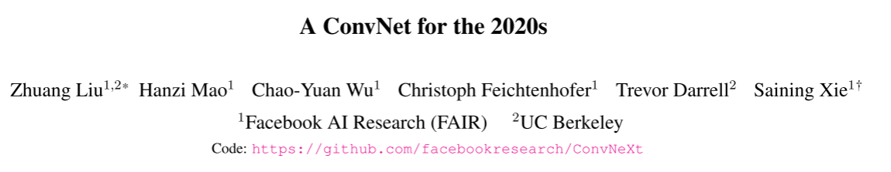

**工作内容概要：**

1. 关于综述论文的阅读和对该方向的基本了解。
2. 学习baseline论文和代码

这两周阅读了两篇综述，主要学习到以下几个方面

**工作内容（ 2023 年 10 月 14日- 2023 年 10 月 28日）:**

1. 综述论文的阅读主要了解到了以下4个方向。

**时空融合方向基本问题**

由于技术和预算的限制，在遥感仪器存在一些权衡，使得难以同时获取高时空分辨率的遥感图像。所以使用时空融合模型来通过高时间低空间分辨率和高空间低时间分辨率的图像来生成高时间高空间分辨率的图像。

**主要数据集**

大致可以分为MODIS高时间分辨率数据和LANDSAT高空间分辨率数据，由这两种数据组成CIA和LGD数据集。

在数据集中的MODEST和LANDSAT数据只用了6个光谱（6个通道）

分别是：蓝、绿、红、近红外、中红外1、中红外2。

**主要评测指标**

- 均方根误差（Root Mean Square Error，RMSE）来评估重建结果的辐射误差
- 结构相似性准则（Structural SIMilarity，SSIM）来评估结构间的相似性
- 采用了一些光谱指标来测量光谱损失
  - 光谱角（Spectral Angle Mapper，SAM）
  - 相对平均光谱误差（Relative Average Spectral Error ， RASE ）
  - 相对全局合成误差（ Erreur Relative Globale Adimensionnelle de Synthese，ERGAS）
  - 四元数 Q4(Quaternion theory-based quality index)

RMSE、SAM、RASE 和 ERGAS 的值越小越好，而 SSIM 和 Q4 的值越大越好

**算法分类**

- 基于加权的方法
- 基于解混的方法
- 基于字典对学习的方法
- 基于神经网络的方法和组合性方法。

2. baseline论文和代码的阅读

论文的主要解决的问题是：利用不同时间同一地点的粗细粒度图像来生成高时间分辨率的精细图像（第一个解决该问题的论文）

解决该问题使用的方法是：

- 使用CGAN驱动网络沿预期方向搜索最优解的思想和LSGAN损失提高GAN的稳定性。
- 使用SwitchNorm来强制模型过滤掉特定于样本中的信息，只提取常见的高通细节

论文的整体框架是：

生成器和鉴别器都是基于ResNet构建块构建，缓解深层网络中梯度消失和梯度爆炸

生成器会通过与训练好的Autoencoder来进行特征损失的计算，减少了抽象高级特征的差异。在生成器生成图片后使用多尺度滤波器来增强输出图像

鉴别器中使用了Spectral normalization来保证隐函数的Lipschitz连续性。

关于代码，整体流程已经熟悉，从输入，训练到输出有一个整体印象。对输入和数据处理已经全部理解，但是训练过程还有很多细节没有弄懂，接下来的任务应该继续理解训练过程和寻找GAN相关的模型，了解GAN的原理和具体如何解决问题。

**下周工作计划：**

1. 对图像融合领域和传统时空融合方法做一个了解，拓展视野。
2. 学习baseline中没有理解的部分，像SwitchNorm、GAN的原理等。
3. 继续读相关论文，总结论文解决的问题和创新点。

11-10——11-24

阅读论文

仔细研究baseline

关于baseline论文的学习，在生成器阶段，作者使用了autoencoder来对生成器生成的图片进行规范。在这里我想了到知识蒸馏，所以去了解了一些知识蒸馏的概念，发现确实很像。知识蒸馏的一个很大的作用就是简化模型，指导学生模型学习到教师模型学到的特征。所以结合老师周4发的SAMFeat，用SAMFeat思想指导学习局部特征（感觉想法和空，接下来应该继续了解和证明是否可行）

**工作内容概要：**

1. 读了4篇论文
1. 了解了一下知识蒸馏方法

**工作内容（ 2023 年 11 月 10日- 2023 年 11 月 24日）:**

主要解决的问题：

很多算法都是讲时空融合处理为单幅图像的超分辨率文。在实际应用中，粗糙图像需要被放大的倍数较大，通常在8到16倍之间。这意味着需要将低分辨率的图像放大到较高的分辨率，使得粗图像的空间信息损失较大。

使用方法：

利用精细图像序列中的时间信息，使用一种称为StfNet的双流卷积神经网络来解决时空融合问题。

创新点：

1. 结合相邻日期获取的精细图像对预测日期的粗略图像进行超分辨
2. 时间序列图像之间的时间关系，并制定了时间约束

模型架构：

双流架构作用体现在用$C_{12}和F_1来预测F_{12}$，$C_{23}和F_3来预测F_{23}$，在通过$F_{13}$的约束和$F_1$和$F_3$生成两张$F'_2$，再通过组合生成最终的$F2$。

个人总结：

时间相关性：从前后的精细图像中找到一个映射关系来预测中间的精细图像。

时间一致性：
$$
F_{12}=F_2-F_1\\
F_{23}=F_3-F_2\\
F_{13}=F_3-F_1\\
\\
F_{13}=F_{12}+F_{23}
$$
预测结果需要满足最后一个式子，所以就出现了时间一致性的约束。

个人总结：

文章的创新主要在于提出了3个新的数据集，且3个数据集包含3个重要的特征。

还提供了一个STF技术的综述，对各个类型的STF算法进行试验，并进行比较。

整体看下来，值得去记忆和学习的只有：

1. 三个数据集和它们的特征。

   (1)**区域多样性。**STF技术有多个应用领域，如城市、农村、森林和山区。因此，STF技术的任何基准数据集都应包括尽可能多的不同土地覆盖情景。换句话说，数据集越多样化，对STF方法的评估就越全面。

   (2)**时间跨度长。**一个特定地区的地表变化可以是非常多样化的。因此，基准数据集应该尽可能多地涵盖这些可能的变化。因此，非常需要覆盖长时间跨度的图像序列。为了测试STF方法的稳健性，这样的序列非常重要。另一方面，从方法论的角度来看，基于深度学习的方法的开发需要相对大量的训练数据集，因此长时间跨度的数据适合于这一背景。

   (3)**具有挑战性的场景。**STF方法的验证还有其他几个挑战，包括精细图像和粗略图像之间的空间分辨率差距、异质区域变化的表征以及土地覆盖变化的预测。这些方面也应包括在STF方法的任何相关基准数据集中。

2. STF方法的分类和代表方法STARFM、ESTARFM、FSDAF、STFDCNN和BiaSTF

   

这篇论文是在帮学长写报告的时候发现的，但是有很多东西都没看懂，所以只通过博客做了一个大概的了解。

总结

探索动机：在2020年，视觉Transformers，尤其是Swin Transformers等分层Transformers开始取代ConvNets，成为通用视觉主干的首选。人们普遍认为，视觉Transformers比ConvNets更准确、更高效、更易扩展。但是大量的工作其实是将之前运用在CNN网络结构上的思路改进到Transformers结构当中去。而且现在有更多的数据，更好的数据增强，以及更加合理的优化器等但所以vision Transformers之所以能够取得SOTA的效果，会不会是这些其他因素影响了网络。Transformers到底是厉害在哪了？

工作目标：如果把这些用在transformer上的技巧用在CNN上之后，进而重新设计ConvNet，卷积能达到的效果的极限是在哪里？是否也能得到相似的结果呢？

 核心思想**：**ConvNeXt在ResNet50模型的基础上，仿照Swin Transformers的结构进行改进而得到的纯卷积模型。模型改进可以分为：整体结构改变、层结构改变和细节改变三大部分。

实现方法：

实现方法部分

> Training Techniques
>
> Macro Design
>
> ResNeXt-ify
>
> Inverted Bottleneck
>
> Large Kernel Sizes
>
> Micro Design

在周三，老师也发了CNN和VIT的比较的微信推文。

推文主要介绍的是CNN和VIT的在在架构、内部表示、鲁棒性和性能方面的比较。而这篇论文是通过对CNN的优化以达到更好的效果。这两篇文章都能在实验中对CNN和VIT的选择进行指导

可以用来对模型使用CNN还是VIT的选择进行指导。

我认为可以学习的点是如何通过对三个部分的改变以达到CNN网络的优化和各个实现方法，在以后的实验中可以进行尝试和替换。

**下周工作计划**：

