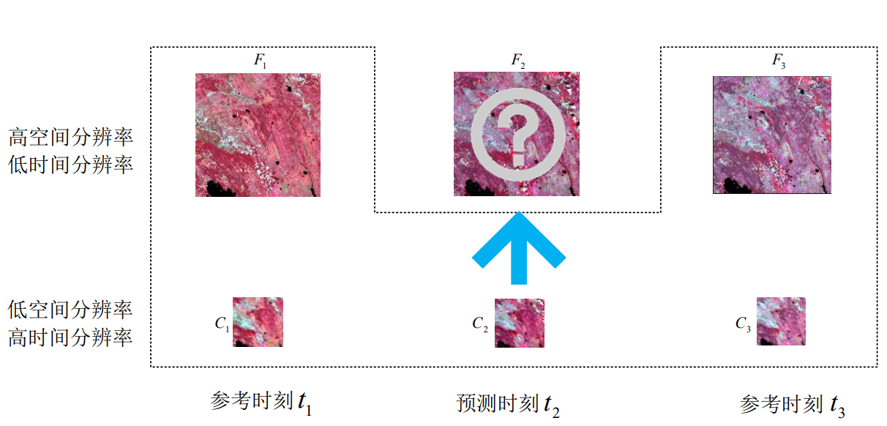
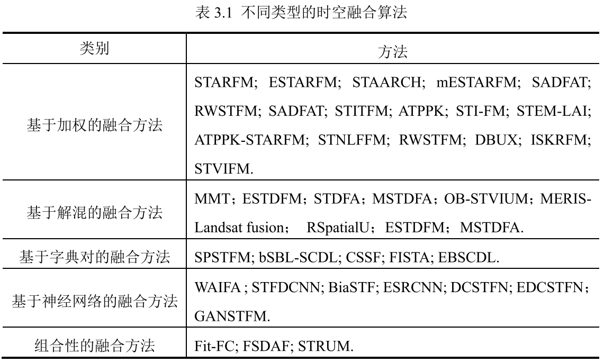
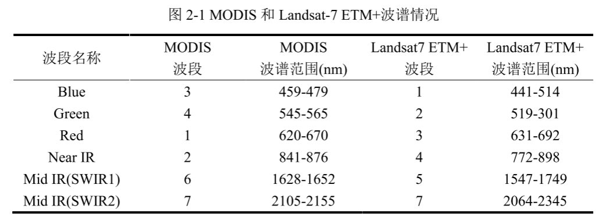

## 学习目标

时空融合的主要任务（问题）

时空融合的数据集

时空融合的主要方法和模型

其他领域的大模型（？？）怎么迁移到具体问题（？？）上来

## 小知识

### 灰度平均值

灰度平均值是指将图像中所有像素的灰度值相加，然后除以像素的总数得到的平均值。灰度值是指图像中每个像素的亮度值，通常在0到255之间。

需要注意的是，灰度平均值只是图像的一个统计量，它反映了整个图像的亮度水平，但并不能完全描述图像的细节和特征。

## **基于深度学习的遥感图像时空融合算法研究_李奇泽**

在一些算法中，已知时刻的图像对要至少两组，即根 据 1 t 和 3 t 时刻的两组高低分辨率图像对建立映射关系，然后输入 2 t 时刻的低分辨 率图像来合成 2 t 时刻缺失的高分辨率图像。

### 国内外研究现状

根据优化策略，现有的**面向单对或最多两对已知图像的时空融合算法**可以分为五类：

- 基于加权的方法
- 基于解混的方法
- 基于字典对学习的方法
- 基于神经网络的方法和组合性方法。

### 作者论文主要研究（工作或总结）

通过对大量的遥感图像时空融合文献进行调研得知，目前**遥感卫星图像的主要矛盾在于时间分辨率、空间分辨率和光谱分辨率三者**不可兼得。

- 将目前不同类型的多种时空融合算法进行综合叙述，分析算法的性能优劣，评估现有的不同时空融合算法。
- 时空融合算法中，应用性比较广的是单对图像时空融合。**对于两种不同卫星之间的空间差异与传感器差异如何建模**成为需要解决的问题。
- 目前时空融合算法都采用多源卫星数据进行实验，几乎没有针对类似高分一号卫星这样的同构平台获取的数据进行时空融合算法研究。事实上，通过同构平台获取的数据，可以避免由于传感器等差异带来的对融合结果的影响，生成质量更好的融合结果。

#### 第二章

**图像超分辨率重建算法**与**时空融合算法**在实际中有很多共性问题

现有的时空融合算法分类，举出代表性的算法进行详细描述，不同类型的图像超分辨率重建算法，不同类型的图像超分辨率重建算法的知识。

##### 2.1 时空融合算法介绍

- 2.1.1 基于加权的融合方法
- 2.1.2 基于解混的融合方法
- 2.1.3 基于字典对的融合方法
- 2.1.4 基于神经网络的融合方法
- 2.1.5 组合性的融合方法

##### 2.2 图像超分辨率重建算法介绍

- 2.2.1 基于插值的图像超分辨率算法
- 2.2.2 基于重建的图像超分辨率算法
- 2.2.3 基于学习的图像超分辨率算法

##### 2.3 常用时空融合数据集介绍

[Landsat 和 MODIS 数据介绍（针对CIA,LGC数据集）](https://zhuanlan.zhihu.com/p/415449467)

(时空融合图片需要考虑的参数或属性：周期、波段、空间分辨率**？？**)

###### 2.3.1 Landsat-7 与MODIS 成对数据集

MODIS（MODerate-resolution Imaging Spectroradiometer）传感器的全称为中分辨率成像光谱仪，Terra 卫星和 Aqua 卫星**每 1-2 天观测一次整个地球表面，获取 36 个波段的数据**，这些数据在检测全球地面、海洋和低空大气层的动态变化有非常的作用。

Landsat-7 是美国的陆地卫星计划（Landsat）中的第七颗**覆盖周期为 16 天，空间分辨率为 30 米，能够获取 8 个波段的数据**

STARFM一文中提供了 **3 对 Landsat-7 与MODIS 组成的成对数据集**，MODIS 卫星传感器于 2001 年 5 月至 9 月期间获取了具有 500 米空间分辨率的MODIS 每日地表反射率产品（MOD09GHK），Landsat-7 卫星在此期间的 2001 年5 月 24 日，2001 年 7 月 11 日和 2001 年 8 月 12 日获取高空间分辨率图像。该成对数据集中，图像大小为 1200×1200，地面覆盖类型主要是森林和稀疏植被斑块，并且植物的生长周期比较短，具有较大的物候变化。

#### 第三章

综合叙述了一些现有的时空融合算法，并在 CIA 和 LGC 两种数据集上对比了不同类别的时空融合经典算法的性能，最后根据融合结果对当前已有时空融合算法进行分析。

##### 3.3 时空融合结果质量评价指标

- 均方根误差（Root Mean Square Error，RMSE）来评估重建结果的辐射误差
- 结构相似性准则（Structural SIMilarity，SSIM）来评估结构间的相似性
- 采用了一些光谱指标来测量光谱损失
  - 光谱角（Spectral Angle Mapper，SAM）
  - 相对平均光谱误差（Relative Average Spectral Error ， RASE ）
  - 相对全局合成误差（ Erreur Relative Globale Adimensionnelle de Synthese，ERGAS）
  - 四元数 Q4(Quaternion theory-based quality index)

RMSE、SAM、RASE 和 ERGAS 的值越小越好，而 SSIM 和 Q4 的值越大越好

[图像质量评价指标](https://www.zhihu.com/column/c_1296043299388555264)

## **Spatiotemporal Fusion of Multisource Remote Sensing Data: Literature Survey, Taxonomy, Principles, Applications, and Future Directions**

### 摘要

具有高空间分辨率的卫星时间序列对于监测异质景观中的陆面动力学至关重要。虽然遥感技术近年来发展迅速，但单一的卫星传感器获取的数据往往无法满足我们的需求。因此，在过去十年中，来自不同传感器的数据的综合使用变得越来越流行。许多时空数据融合方法已被开发出来，以产生合成图像的高空间和时间分辨率从两种类型的卫星图像，频繁的粗分辨率图像，稀疏的精细分辨率图像。**这些方法是根据不同的原则和策略设计的，因此表现出不同的优势和局限性**。这种多样性给用户选择适合其具体应用和数据集的方法带来了困难。为此， **本文对当前时空数据融合方法进行了文献综述，对现有方法进行了分类，探讨了这些方法的基本规律，总结了它们的潜在应用，并提出了该领域未来的研究方向**

## 基于深度学习的图像融合方法综述

摘 要: 图像融合技术旨在**将不同源图像中的互补信息整合到单幅融合图像中以全面表征成像场景,并促进后续的视觉任务**。 随着深度学习的兴起,基于深度学习的图像融合算法如雨后春笋般涌现,特别是**自编码器、生成对抗网络以及 Transformer 等技术**的出现使图像融合性能产生了质的飞跃。 本文对不同融合任务场景下的前沿深度融合算法进行全面论述和分析。

（1） 首先,介绍图像融合的基本概念以及不同融合场景的定义。 针对多模图像融合、数字摄影图像融合以及遥感影像融合等不同的融合场景,从网络架构和监督范式等角度全面阐述各类方法的基本思想,并讨论各类方法的特点。 

（2）其次,总结各类算法的局限性,并给出进一步的改进方向。 

（3）再次,简要介绍不同融合场景中常用的数据集,并给出各种评估指标的具体定义。 对于每一种融合任务,从定性评估、定量评估和运行效率等多角度全面比较其中代表性算法的性能。 

（5）本文提及的算法、数据集和评估指标已汇总至 https: / /github. com/Linfeng-Tang /Image-Fusion。 最后,给出了本文结论以及图像融合研究中存在的一些严峻挑战,并对未来可能的研究方向进行了展望。

关键词:图像融合;深度学习;多模图像;数字摄影;遥感影像

## 时空融合baseline

A flexible reference-insensitive spatiotemporal fusion model for remote sensing images using conditional generative adversarial network

**摘要：**针对遥感影像时空分辨率之间的矛盾，提出了时空融合模型来合成高时空分辨率的影像序列。目前，时空融合模型通常采用在预测日期获取的一幅粗分辨率图像和接近预测时间的至少另一对粗-细分辨率图像作为参考来导出预测日期的细分辨率图像。经过多年的发展，模型的精度有了一定的提高，但几乎所有的模型都要求至少三幅图像输入，并且必须对参考图像施加严格的时间约束，以保证融合精度。然而，在实际应用中，由于天气条件恶劣或粗、细分辨率数据源时间不一致等原因，很难收集到足够的数据对进行细分辨率图像序列模拟，给实际应用带来了一定的困难。**本文将条件生成对抗网络（CGAN）和可切换归一化技术引入时空融合问题，提出了一种灵活的深度网络GAN-based SpatioTemporal Fusion Model（GAN-STFM），以减少模型输入的数量，打破对参考图像选择的时间限制**。GAN-STFM只需要一个粗分辨率的图像在预测日期和另一个精细分辨率的参考图像在任意时间在同一地区的模型输入。据我们所知，这是第一个时空融合模型，只需要两个图像作为模型输入，并没有限制的获取时间的参考。即便如此，GAN-STFM在实验中的表现与其他经典融合模型相当或更好。这种改进使得时空融合的数据准备变得更加容易，具有良好的应用前景。

DCSTFN

### github网站

https://github.com/junjun-jiang/Hyperspectral-Image-Super-Resolution-Benchmark