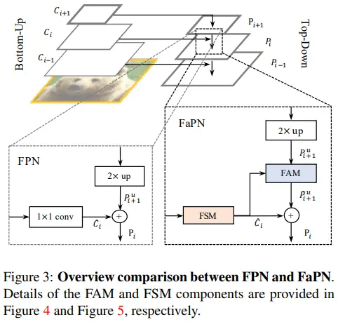
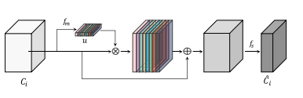
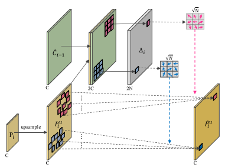

[FaPN：用于密集图像预测的特征对齐金字塔网络](https://www.jianshu.com/p/38764d92f704)

[FaPN: Feature-aligned Pyramid Network for Dense Image Prediction（paperswithcode）](https://paperswithcode.com/paper/fapn-feature-aligned-pyramid-network-for)

FaPN: Feature-aligned Pyramid Network for Dense Image Prediction

**摘要：**深度神经网络的最新进展在密集图像预测方面取得了显著的进步。然而，为了简单起见，大多数现有方法仍然忽略了特征对齐问题。上采样特征和局部特征之间的直接像素相加会导致具有未对齐上下文的特征图，进而导致预测中的错误分类，尤其是在对象边界上。在本文中，我们提出了一种特征对齐模块，该模块学习像素的变换偏移量，以在上下文中对齐上采样的高级特征；以及另一个特征选择模块，用于强调具有丰富空间细节的较低层次特征。然后，我们将这两个模块集成到自顶向下的金字塔结构中，并提出了特征对齐金字塔网络（FaPN）。对四个密集预测任务和四个数据集的广泛实验评估证明了FaPN的有效性，当与Faster/Mask R-CNN使用时，与FPN相比，AP/mIoU的总体改善为1.2-2.6点。特别是，当与Mask Former集成时，我们的FaPN在ADE20K上达到了56.7%mIoU的最高水平。

#### 理论部分

特征对齐：随着逐步下采样，边界细节的损失会越来越大，针对这种情况，SegNet [2] 在其编码器中存储了最大池化指数，并在解码器中使用相应存储的最大池化指数对特征图进行上采样。GUN [35] 并不像 SegNet 那样在编码器中记忆空间信息，而是在解码器中进行上采样之前先学习引导偏移，然后根据这些偏移对特征图进行上采样。为了解决 RoIPool 中量化造成的提取特征与 RoI 之间的不对齐问题，RoIAlign [13] 避免了任何量化，并通过线性插值计算每个 RoI 的值。为了在大运动量的视频还原中建立多帧之间的精确对应关系，TDAN [42] 和 EDVR [43] 在特征层通过可变形卷积 [10] 实现了隐式运动补偿。AlignSeg [17] 和 SFNet [22] 是两个同时进行的工作，它们与我们的动机相似，都是基于流的配准方法。其中，AlignSeg 提出了一种自下而上的双分支网络，并使用两种类型的配准模块来减轻特征聚合前的特征错配。相比之下，我们建议在自下而上网络的基础上构建一个自上而下的路径，并以渐进的方式从最粗分辨率（顶部）到最细分辨率（底部）对齐特征。具体来说，我们只将 2 倍上采样的特征与相应的自下而上的特征进行对齐，而 AlignSeg 则试图直接对齐不同比例的特征（即从 1/4、1/8 甚至 1/16 上采样），这很困难，而且不一定总是可行。

这篇论文特征对齐是怎么对齐的。

 

FSM：特征选择模块

在对详细特征进行通道缩减之前，重要的是强调包含大量空间细节的重要特征图，以便在抑制冗余特征图的同时进行精确分配。

$$
\hat C_i=f_s(C_i+u*C_i)\\
u=f_m(z)
$$
其中$z$通过对$\hat C_i$进行全局平均池化得到

$f_m$表示一个1x1的卷积得到$u$

$f_s$也表示一个1x1卷积，最终得到$\hat C_i$

FAM：特征对齐模块

**通过逐元素添加或逐通道级联进行的特征融合将损害对象边界周围的预测**。

$$
\mathbf{\hat{P}}^{u}_{i} = f_{a}\big(\mathbf{P}^{u}_{i}, \mathbf{\Delta}_{i}\big)\\
\mathbf{\Delta}_{i} = f_{o}\big([\mathbf{\hat{C}}_{i-1}, \mathbf{P}_{i}^{u}]\big)
$$

具体做法：

对$P_i$运用bilinear线性插值进行2倍上采样生成$\mathbf{P}^{u}_{i}$

对$P_{i-1}$进行特征选择(FSM模块)生成$\mathbf{\hat{C}}_{i-1}$

通过1x1卷积对$C_{i-1},\mathbf{P}^{u}_{i}*2$的cat进行卷积生成$\mathbf{\Delta}_{i}$（为什么进行卷积就能生成偏移量）

通过可形变卷积对$\mathbf{P}^{u}_{i}, \mathbf{\Delta}_{i}$卷积生成中间变量

最后再通过relu激活中间变量生成对齐后的特征

FaPN：特征对齐金字塔网络

#### 代码段

**FAN类**

这段代码定义了一个名为`FAN`的类，它是`Backbone`类的子类。`FAN`模块实现了论文`FPN`中的特征金字塔网络（FPN）。它根据输入特征地图的分辨率构建金字塔特征。

以下是代码的主要步骤：

1. 初始化`FAN`类，设置一些属性，如输入特征地图、输出通道数、归一化和顶部块等。
2. 检查输入的`bottom_up`是否为`Backbone`类的实例。
3. 获取`bottom_up`模块生成的多尺度特征图的名称和分辨率。
4. 检查输入的特征图是否按高到低的分辨率顺序排列。
5. 初始化`align_modules`和`output_convs`列表。
6. 遍历输入特征图的每个特征，并执行以下操作：
    a. 计算当前特征的阶段（即2的幂次方）。
    b. 创建一个名为`lateral_norm`的正则化层（如果`norm`为空，则不应用正则化）。
    c. 创建一个名为`align_module`的特征对齐模块（即`FeatureAlign_V2`）。
    d. 将`align_module`添加到`self`中，并将其命名为`fan_align{}`。
    e. 将`output_conv`添加到`self`中，并将其命名为`fpn_output{}`。
7. 初始化顶部块（如果有的话）。
8. 设置输出特征的步长和通道数。
9. 设置输出特征的名称。
10. 定义`forward`方法，该方法接受一个输入字典，其中包含按高到低的分辨率顺序排列的特征图名称。
    a. 将`bottom_up`模块的输出特征图反向排列。
    b. 遍历输入特征图的每个特征，并执行以下操作：
     i. 使用`align_module`对当前特征和上一个特征进行对齐。
     ii. 将结果插入到结果列表的开头。
    c. 如果顶部块存在，则将顶部块的输出特征图添加到结果列表中。
    d. 返回一个字典，其中包含按名称排列的输出特征图。
11. 定义`output_shape`方法，该方法返回一个字典，其中包含每个输出特征图的通道数和步长。

总之，`FAN`类定义了一个特征金字塔网络，该网络根据输入特征图的分辨率构建金字塔特征。它允许使用不同的对齐模块和顶部块来扩展特征图。