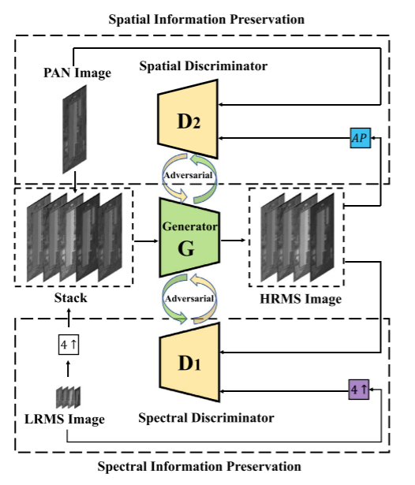

###### PAN-GAN

2020年

摘要

遥感图像融合中的泛锐化是指将全色图像和低分辨率的多光谱图像进行融合，得到高分辨率的多光谱图像。近年来，基于卷积神经网络(CNN)的泛锐化方法取得了最好的效果。尽管如此，仍然存在两个问题。一方面，现有的基于CNN的策略需要监督，低分辨率的多光谱图像是通过简单地对高分辨率的图像进行模糊和下采样来获得的。另一方面，它们通常忽略了全色图像丰富的空间信息。为了解决这些问题，我们提出了一种基于产生式对抗网络的无监督泛锐化框架，称为Pangan，它在网络训练过程中不依赖于所谓的地面事实。在我们的方法中，生成器分别与光谱鉴别器和空间鉴别器建立对抗性博弈，从而保留了多光谱图像丰富的光谱信息和全色图像的空间信息。通过大量的实验验证了所提出的泛GaN锐化方法与其他先进的泛化锐化方法相比的有效性。我们的PanGAN在定性视觉效果和定量评估指标方面表现出了良好的性能。

解决的问题：

（1）现有的基于CNN的策略需要监督，其中低分辨率多光谱图像是通过简单地对高分辨率图像进行模糊和向下采样来获得的。

（2）通常会忽略全色图像的丰富空间信息。

解决方法：

提出了一种基于产生式对抗网络的无监督泛锐化框架PanGAN可以共同保留LRMS图像的丰富光谱信息和全色图像的丰富空间信息。

创新点：

1）与其他基于CNN的泛锐化方法不同，无监督泛锐化框架 (Pan-GAN) 基于生成对抗网络，该网络不依赖于所谓的groundtruth，并且训练过程基于原始源图像通过设计特定的损失函数。

2）提出的Pan-GAN采用两个鉴别器来强制生成的图像的光谱和空间信息分别与LRMS和全色图像一致。这样，可以同时保留LRMS图像的丰富光谱信息和全色图像的丰富空间信息。

3）提供了Pan-GAN与其他最新方法之间的定性和定量比较，以显示所提出方法的有效性和优越性。

模型架构

生成器G通过输入全色图像和多光谱图片生成高分辨率高光谱图像，再通过两个鉴别器来在频谱和空间信息之间取得平衡。

