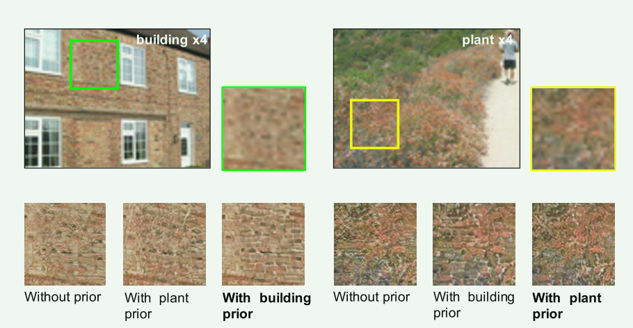
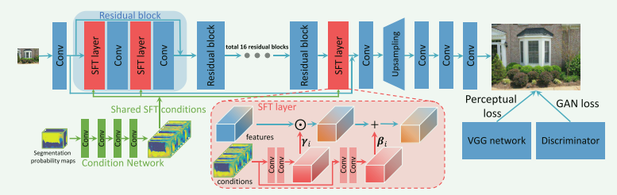

[详细解读SFTGAN，恢复图像超分辨率的真实纹理](https://zhuanlan.zhihu.com/p/314620956?utm_id=0)

写得很好的一篇文章：

1）从论文解决的问题

2）为什么现有模型会产生这个问题

3）这个问题出现在哪里？也就是这篇论文是怎么解决这个问题的

4）论文创新点有没有实验支持

5）创新点解析

###### Recovering Realistic Texture in Image Super-resolution by Deep Spatial Feature Transform

SFTGAN

尽管卷积神经网络（CNN）最近已经证明了单图像超分辨率（SR）的高质量重建，但**恢复自然和逼真的纹理**仍然是一个具有挑战性的问题。在本文中，我们表明，它是可能的，**以恢复纹理忠实于语义类**。特别是，我们只需要在一个基于语义分割概率图的网络中调整几个中间层的特征。这是通过一个新的**空间特征变换（SFT）层**，**生成仿射变换参数的空间方式的功能调制**。SFT层可以使用相同的损失函数与SR网络一起进行端到端训练。在测试过程中，它接受一个任意大小的输入图像，并生成一个高分辨率的图像，只有一个单一的前向通过条件的分类先验。我们的最终结果表明，与最先进的SRGAN [27]和EnhanceNet [38]相比，配备SFT的SR网络可以生成更逼真和视觉上更令人满意的纹理。

解决的问题：

解决超分任务中对**图像的纹理信息**恢复的不好的问题，一开始的超分网络使用mse loss，导致的生成的图像比较模糊和过于光滑的纹理。后人开始改进**损失函数**，开始使用Perceptual Loss 和 Adversarial Loss，但是依然存在**图像的纹理信息**恢复的不好的问题。

问题提出背景

Perceptual Loss 和 Adversarial Loss虽然能够在重建HR图像时带来更加细节的信息 (fine details)，但是这些信息与原图的关联度不够大。换句话说，这些细节信息虽然够细节，但不反映原图的细节，细节信息不匹配导致重建的图像细节服从于类别（没有对齐？？？）。

这幅图里面有个LR的building图片和plant图片，我们随机取相同位置的一个patch，就是图中绿色和黄色的框，你会发现这两个patch很像，换句话说，不同class的图像片段在低分辨率的时候可能取值都是一样的。

这个问题出在哪里？

已有的超分模型没办法识别出LR图片是哪个类别的。building和plant的低分辨率图像块非常类似，导致模型分别不能重建出两个的细节信息。虽然结合生成对抗式网络（GAN）进行超分复原，若未考虑图像区域的类别先验信息，获得的结果虽然增加了纹理细节，但是并不符合图像区域本身应该具有的纹理特点。

所以该论文将**分割的图(语义图)**传入模型，论文中这个分割的图叫做categorical prior。

（前置知识）在超分辨率任务中，其实就是对原图像的不同列别的目标进行上采样，假如不同列别在低分辨率的rgb 值是一样或者相似的，那么在上采样的时就，模型就很难区分当前图像的片断属于哪一个列别，从而导致合成的图像的纹理不真实。

所以，这篇论文提出了**使用先验类别信息来解决超分辨率纹理不真实的问题**，就是在超分辨率的合成中使用**语义图**，**语义图的生成使用了图像分割网络**。其能提供像素级的图像区域信息，每个像素点的概率向量能够更精细地调控纹理结果。

下一个问题就是怎么把语义图和超分模型结合起来，如果你为每个类别训练一个超分模型显然不可能。如果你简单地把语义图和中间的feature map concat起来又没法充分发挥语义图的作用，**作者的方案是SFT模块。**它能将额外的图像先验（比如语义分割概率图）有效地结合到网络中去，恢复出与所属语义类别特征一致的纹理。 SFT层以语义分割概率图为条件，基于语义分割概率图，它生成一对调制参数，以在空间上对网络的特征图应用仿射变换。SFT层有3点好处：

- 节约参数。
- 即插即用，很容易与先有模型结合。
- 可扩展，prior不仅仅可以是语义图，也可以是深度图等等。

SFT layer架构

本文提出的空间特征调制层受到条件BN层的启发，但是条件BN层以及其他的特征调制层（比如FiLM），往往忽略了网络提取特征的空间信息，即对于同一个特征图的不同位置，调制的参数保持一致。但是超分辨率等底层视觉任务往往需要考虑更多的图像空间信息，并在不同的位置进行不同的处理。基于这个观点，本文提出了空间特征调制层，其结构如图2所示。

空间特征调制层对网络的中间特征进行仿射变换，变换的参数由额外的先验条件（如本文中考虑的语义分割概率图）经过若干层神经网络变换得到。若以 F表示网络的特征， $\gamma$ 和 $\beta$分别表示得到的仿射变换的尺度和平移参数，那么经过空间特征调制层得到的输出特征为：

$SFT(F|\gamma,\beta)=\gamma \odot F+\beta$

空间特征调制层可以方便地被集成至现有的超分辨率网络，如SRResNet等。图4是本文中使用的网络结构。为了提升算法效率，先将语义分割概率图经过一个Condition Network得到共享的中间条件，然后把这些条件“广播”至所有的SFT层。本文算法模型在网络的训练中，同时使用了perceptual loss和adversarial loss，被简称为SFT-GAN。

网络的输出为：

$\hat y=G_\theta(x|\gamma,\beta)$	$(\gamma,\beta)=M(\Phi)$

其中， Φ 是先验， M 是一个mapping function，把prior映射为 $\gamma,\beta$。

mapping function可以是任意的函数，作者用了一个神经网络，参数随主网络一起训练。

作者也用了一个小网络得到conditions，输入是语义图，输出是conditions，这些conditions对于每一层来说是共享的，被广播到所有的SFT层里面。

- **作为先验的语义图**

本节论述分割网络输出语义图，LR图片先经过双线性插值进行上采样，再经过一个分割网络作为输入。分割网络在COCO上进行训练，在ADE上进行fine-tune。

- **总体网络结构**

上图为生成器的结构，假设判别器为D，它们使用GAN的minimax optimization进行训练：

$\min_\theta\max_\eta E_{y~P_{HR}}logD_\eta(y) + E_{x~P_{LR}}log(1-D_\eta(G_\theta(x)))$

网络分为2部分：conditional network和 SR network。

conditional network输入为语义图，经过4层卷积 (kernel size = 1)，输出为intermediate conditions。

SR网络使用16个残差块，每个残差块中都有SFT层，如图2所示，这些SFT层共享intermediate conditions。不同的SFT层有不同的 $\gamma,\beta$ 值。

- **损失函数**

**perceptual loss：**

$L_P=\sum_i\|\Phi(\hat y_i)-\Phi(y_i)\||_2^2$

**GAN Loss：**

$L_D=\sum_ilog(1-D_\eta(G_\theta(x_i))$

代码中的SFT模块是怎么实现的

和架构图画的几乎一模一样，其中的激活函数没有画出，使用的是relu，负斜率是0.1。

在SFT层中，$\odot$表示的是乘法（F*（1+\gamma) [**这里没有搞懂为什么是1+\gamma**]
