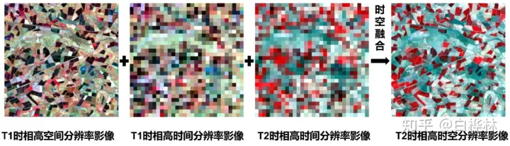
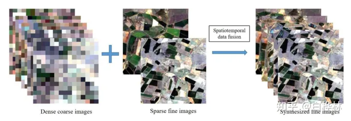

工具类

[CVPR 2023 论文和开源项目合集(Papers with Code)](https://github.com/amusi/CVPR2023-Papers-with-Code)

[记录每天整理的计算机视觉/深度学习/机器学习相关方向的论文](https://github.com/amusi/daily-paper-computer-vision)

[Awesome-Data-Fusion-for-Remote-Sensing](https://github.com/px39n/Awesome-Data-Fusion-for-Remote-Sensing)

[Hyperspectral-Image-Super-Resolution-Benchmark](https://github.com/junjun-jiang/Hyperspectral-Image-Super-Resolution-Benchmark)

[Awesome-Data-Fusion-for-Remote-Sensing](https://github.com/px39n/Awesome-Data-Fusion-for-Remote-Sensing)

[GPT 学术优化 (GPT Academic)](https://github.com/jio-H/gpt_academic)

[EDVR作者主页](https://www.mmlab-ntu.com/person/ccloy/)

学习类

:ballot_box_with_check: [（附文献和代码）多源遥感影像时空融合技术介绍](https://zhuanlan.zhihu.com/p/601897889)

[图像融合常用数据集整理](https://zhuanlan.zhihu.com/p/508051065)

[[遥感]遥感**变化检测**文献/数据集资源列表推荐](https://zhuanlan.zhihu.com/p/528959742)

[笔记 | 基于深度学习的空谱遥感图像融合综述](https://zhuanlan.zhihu.com/p/569415087?utm_id=0)

[遥感分辨率及图像知识大全](https://zhuanlan.zhihu.com/p/437700025)

[条件生成对抗网络——cGAN原理与代码](https://zhuanlan.zhihu.com/p/629503280?utm_id=0)

[AIGC之图像生成内容介绍](https://zhuanlan.zhihu.com/p/629914637)

[VAE-变分自编码器系列](https://cloud.tencent.com/developer/article/2328570)

[其实SAM是个好老师 | SAMFeat教你如何结合自己的模型和SAM设计一个更好的模型](https://mp.weixin.qq.com/s/VOS0m7bMJU9E468Lk6eRNg)

[Landsat 和 MODIS 数据介绍（针对CIA,LGC数据集）](https://zhuanlan.zhihu.com/p/415449467)

## 时空融合的目的

目前单一卫星传感器获取的影像数据无法同时兼顾高空间分辨率和高时 间分辨率。因此，国内外学者提出了许多遥感图像时空融合方法，来生成同时具 有高空间分辨率与高时间分辨率的遥感图像

其实可以看作是带更多约束条件的分辨率，其目的是为了获取连续的、高空间分辨率的影像，解决光学遥感影像在**时间分辨率和空间分辨率的矛盾**：现有的大多数卫星获取的影像在空间分辨率能做到较高，那么它的回访周期就很漫长。

- **通俗理解**

卫星带着相机对准地表拍摄，并绕着地球旋转，那如果卫星拍摄区域小，那拍出来的照片的就更加清晰（空间分辨率高），但是要拍完整个地球要花更多时间（时间分辨率低），如果卫星拍的面积更大，拍完整个地球一遍要花更少时间，但是照片更加模糊。

## 解决方法

那么如何才能获取高时空分辨率的影像呢？为什么要用时空融合技术来实现呢？

实际上，现有的办法主要有三种：

（1）多个搭载相同传感器的卫星组网，例如sentinel-2A和sentinel-2B双星，回访周期缩短一半；

（2）提高传感器性能和卫星的观测技术；

（3）将高时间分辨率影像和高空间分辨率影像进行融合来获取高时空分辨率影像。

## 基础原理

时空融合的基础原理如下图所示，其本质是结合两类影像的时空优势。

T1时相为我们能获取到两类影像的时相，T2时相是只有高时间分辨率影像的时相

上图只考虑了一对可用影像的情况，实际上很多算法会使用多对历史影像来提高融合的可靠性，如下图：

图片来自文献[https://doi.org/10.3390/rs10040527]

## STFDCNN

STFDCNN算法，该算法中引入了卷积神经网络来建模空间分辨率不一致的问题，来生成具有高时空的高分辨率图像

## GAN的提出和应用

GAN首先由Goodfellow等人提出[25]，然后，基于GAN的应用出现了爆炸式增长，例如图像生成[26]，超分辨率[27]，去噪[28]，修复[29]和图像到图像的翻译[30]，显示了其强大的建模能力。

[GAN详解](https://zhuanlan.zhihu.com/p/408766083)

## DCSTFN

## 略读论文

红色字体：表示疑问的地方

黄色标记：表示使用的方法

蓝色字体：表示解决的问题

###### Image De-raining Using a Conditional Generative Adversarial Network

摘要-恶劣的天气条件，如雨雪，对在这种条件下拍摄的图像的视觉质量产生不利影响，从而使它们无法进一步使用和共享。此外，这种退化的图像极大地影响了视觉系统的性能。因此，解决单幅图像去雨问题是非常重要的。然而，这个问题固有的不适定性带来了几个挑战。我们试图利用最近引入的条件生成对抗网络(CGAN)的强大生成建模能力，**通过施加额外的约束**，即去雨图像必须与其对应的地面真实干净图像不可区分。来自GAN的对抗性损失提供了额外的规律性，并有助于实现更好的结果。除了提出一种去雨图像的新方法外，我们还**在生成器-鉴别器对中引入了一种新的精化损失函数和结构新颖性，以获得更好的结果**。Lost函数旨在减少Gans引入的伪影，并确保更好的视觉质量。生成器子网络是使用最近引入的密集连接网络来构建的，而鉴别器被设计为利用全局和局部信息来判断图像的真伪。在此基础上，我们提出了一种新的单幅图像去雨方法--图像去雨条件生成对抗性网络(ID-CGAN)，该方法在目标函数中综合考虑了量化性能、视觉性能和判别性能。在合成图像和真实图像上的实验表明，该方法在量化和视觉性能方面都优于目前最先进的单幅图像去雨方法。此外，在FasterRCNN的目标检测数据集上的实验结果也证明了该方法在提高对降雨退化图像的检测性能方面的有效性。

[粗略讲解](https://blog.csdn.net/mmdbhs/article/details/122170935)

###### 对齐问题到底是什么？

特征对齐

[Re-ID中的特征对齐](https://zhuanlan.zhihu.com/p/126722559)

###### 知识蒸馏

[知识蒸馏方法总结（持续更新）](https://zhuanlan.zhihu.com/p/603748226)

[知识蒸馏（一）概述](https://zhuanlan.zhihu.com/p/581286422)

[知识蒸馏（Knowledge Distillation）简述（一）](https://zhuanlan.zhihu.com/p/81467832)

大概的理解

知识蒸馏，可以将一个网络的知识转移到另一个网络，两个网络可以是同构或者异构。做法是先训练一个teacher网络，然后使用这个teacher网络的输出和数据的真实标签去训练student网络。知识蒸馏，可以用来将网络从大网络转化成一个小网络，并保留接近于大网络的性能；也可以将多个网络的学到的知识转移到一个网络中，使得单个网络的性能接近emsemble的结果。

###### ViTGAN: Training GANs with Vision Transformers

中探索了使用 ViT 作为生成对抗网络 (GAN) 中图像合成任务的生成器和判别器的潜力。本文研究了在 GAN 背景下 ViT 与传统卷积架构的性能比较。

该论文的主要发现包括：

**基于 ViT 的 GAN 的性能与卷积 GAN 相当：**结果表明，利用 ViT 作为生成器和判别器的 ViTGAN 在图像合成质量方面与传统卷积 GAN（例如 StyleGAN2）具有相似的性能。

**改进的架构灵活性：**与卷积 GAN 相比，ViTGAN 提供了增强的架构灵活性。作者证明，ViTGAN 可以通过调整 Transformer 层的数量或 token 的数量来扩展，而不改变空间维度，从而更容易使模型适应不同的计算预算和问题规模。

**有效的迁移学习：**研究表明，预训练的 ViT 模型可以成功地作为 GAN 中的生成器进行微调，从而显著减少训练时间，同时保持竞争性能。这一发现强调了在图像合成任务中使用预先训练的 ViT 进行迁移学习的潜力。

**对输入变化的鲁棒性：**ViTGAN 对输入分布的变化表现出鲁棒性，如对损坏和分布外样本的实验所示。作者认为，ViT 中的注意力机制有助于这种鲁棒性，使模型能够有效地处理输入数据的变化。

总之，这项研究强调了在生成对抗网络中使用 ViT 来执行图像合成任务的优势。研究结果表明，基于 ViT 的 GAN 在图像质量、架构灵活性和迁移学习潜力方面优于传统的卷积 GAN。这些见解可以指导研究人员和从业者为图像合成应用选择合适的架构，并进一步探索 ViT 在该领域的潜力。

STFGAN

摘要：由于技术和预算的限制，时空融合被认为是一种很有前途的方法来处理遥感图像的时间和空间分辨率之间的权衡。此外，生成对抗网络（GAN）已经在各种应用中显示出其能力。提出了一种基于GAN的遥感图像时空融合方法（STFGAN），该方法采用两阶段框架，每一阶段都有一个端到端的图像融合GAN（IFGAN）。IFGAN包含一个生成器和一个在优化函数指导下相互竞争的搜索器。针对高时空分辨率Landsat影像与低时空分辨率MODIS影像之间存在的巨大空间分辨率差异，采用了特征级融合策略。具体来说，对于生成器，我们首先对MODIS图像进行超分辨率处理，同时提取Landsat图像的高频特征。最后，我们综合了MODIS和Landsat图像的特征。STFGAN能够学习Landsat-MODIS图像对之间的端到端映射，并通过考虑所有波段来预测预测日期的Landsat-like图像。STFGAN显着提高了物候变化和土地覆盖类型变化的预测精度的帮助下，剩余块和两个先前的Landsat-MODIS图像对。为了检验所提出的STFGAN方法的性能，实验进行了三个代表Landsat-MODIS数据集。结果清楚地说明了所提出的方法的有效性。生成对抗网络（GAN），多光谱卫星数据，遥感，时空融合。

传统算法假设各土地覆被类型的比例在观测期间不发生变化的前提下建立的，没有考虑地球表面的人类活动，如干扰事件（如森林火灾）和城市土地利用的变化。

Huang和Song[32]提出了基于稀疏表示的时空反射融合模型（SPSTFM），这是第一个将**自然图像超分辨率中的字典对学习技术引入时空数据融合**的方法。

**复杂的异质区域（complex heterogeneous areas）**

在遥感图像时空融合中，复杂的异质区域通常指的是地表上存在多种不同类型、不同性质或不同状态的地物或覆盖物，并且它们可能在时空上表现出复杂的变化。这些区域可能包括各种土地覆盖类型、植被、土壤、水体、建筑物等。

异质性表现在不同区域之间的差异性，这种差异性可能由于地物的物理性质、生态环境、人类活动等多种因素引起。这使得对这些区域进行准确的遥感监测和分析变得更为具有挑战性。

在时空融合的背景下，通过整合来自不同传感器或不同时间点的遥感数据，可以提高对这些复杂异质区域的识别和监测的精度。例如，结合高空间分辨率的光学图像和高时间分辨率的雷达图像，可以更全面地了解异质区域的特征，并提供更详细、准确的信息。这种融合可以帮助遥感分析师和地学研究者更好地理解和监测地球表面的变化。

**不是端到端？**

首先，STFDCNN 和 StfNet 不是端到端的学习模型。预测阶段分为两部分--基于 CNN 的映射和重建，这增加了算法的复杂性。其次，每个波段都需要单独训练，这增加了参数量、内存使用量和训练时间。

端到端学习（End-to-End Learning）是指通过一个统一的、端到端的模型来完成一个完整的任务，而无需显式地拆分任务为多个独立的阶段或模块。在深度学习中，端到端网络是一种直接从输入数据到最终输出的模型，无需手动设计中间层或特征提取步骤。

传统的机器学习方法通常包含数据预处理、特征提取、模型训练和最终预测等多个步骤，每个步骤都可能需要手动设计和调整。端到端学习的思想是将这些步骤通过一个端到端的神经网络统一起来，让网络自动学习从输入到输出的映射关系，从而简化整个系统的设计和调试过程。

端到端学习的优势在于它可以更好地适应复杂的任务和数据，避免手动设计特征提取器的复杂性。然而，端到端学习的挑战之一是可能需要更大规模的数据和计算资源，以及对网络架构的仔细调整，以使其在实际任务中表现良好。

在深度学习中，许多应用，如语音识别、图像分类、机器翻译等，都可以通过端到端学习的方式进行建模，从而简化整个系统的设计。

**论文网络大致流程和优点**

在所提出的方法中，开发了一个两阶段框架来提高融合结果的准确性，其中每个阶段都包含一个端到端的图像融合GAN（IFGAN）。发生器和鉴别器以交替的方式进行优化，以使发生器尽可能有效地工作。具体来说，生成网络由三部分组成：1）MODIS图像的超分辨率；2） 陆地卫星图像的高频特征提取；和3）MODIS和陆地卫星特征图的融合。前两部分是通过残差块实现的。

1）据我们所知，这是第一个基于深度学习的**端到端**可训练网络，可用于解决时空融合问题。

2）为了从生成器中产生更好的时空融合结果，我们为生成器网络中的Landsat输入和MODIS输入开发了残差块结构。该方法可以捕捉到更多的纹理细节，并可以显著提高物候变化和土地覆盖类型变化预测的精度，借助于之前的两个Landsat-MODIS图像对。

3）将遥感图像的所有波段一起输入到网络中，而不是单独输入每个波段，这降低了时间和空间的消耗，特别是对于大范围的图像。

**超分辨率和时空融合之间存在的一些区别**

1）分辨率差异：一般来说，超分辨率的放大系数在2到4到8之间。然而，在时空融合中，两个数据源之间可能存在巨大的空间分辨率差距，通常在8到16之间(例如，空间分辨率为250/500米的陆地卫星和空间分辨率为30米的MODIS)。在这种情况下，直接将超分辨率方法应用于时空融合会导致结果的准确性较低。

2）空间差异：众所周知，遥感图像比自然图像包含更多的信息。这是因为遥感图像包含了更多的地理信息。复杂的特征类型和丰富的纹理特征增加了时空融合的难度。

3）时间差异：在单幅图像超分辨率下，只有一幅LR图像作为输入。相比之下，在时空融合中，有一对或两对先前日期的LR-HR图像对可用。利用图像对的空间细节信息作为补充信息源，可以在预测日提高LR图像的空间分辨率。

4）光谱差异：与自然图像不同，遥感图像有多个波段，只有红、绿、蓝三个波段。
